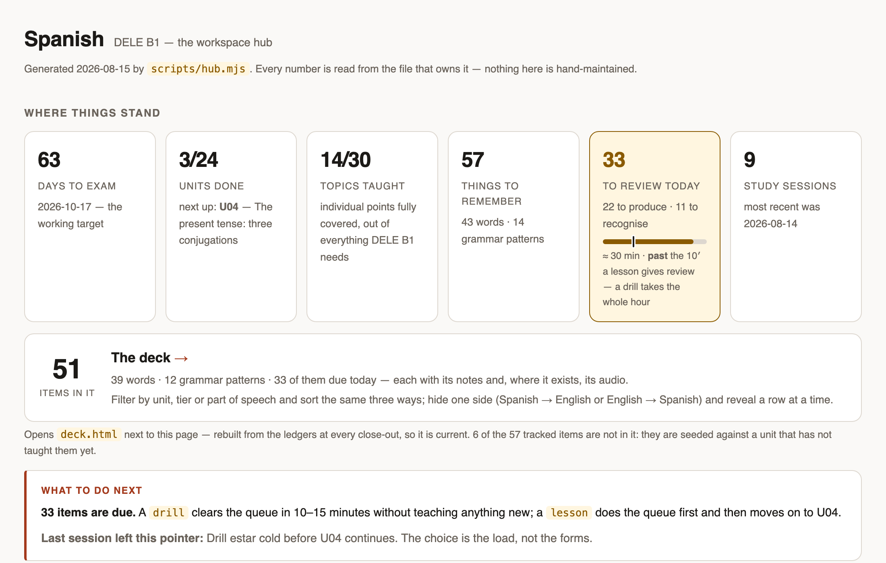
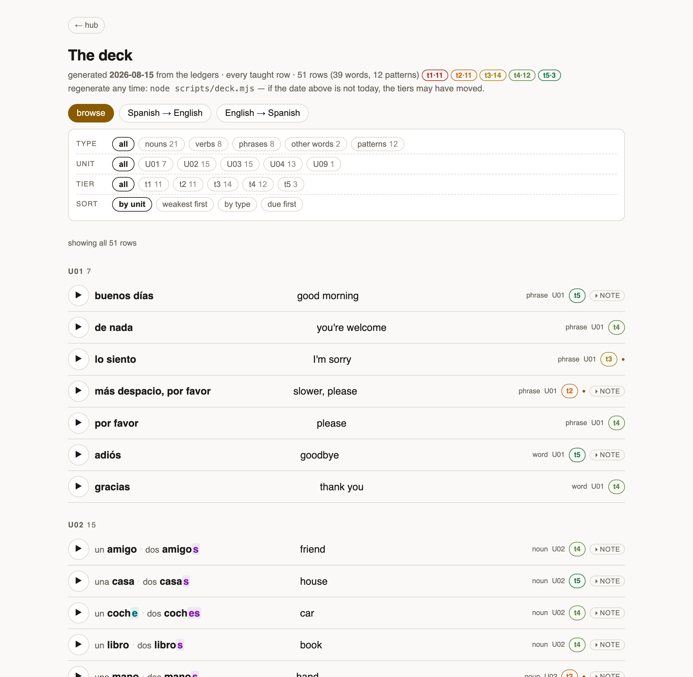
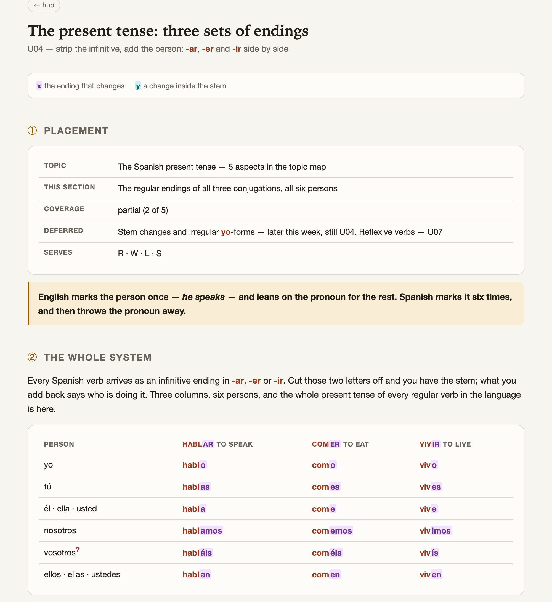
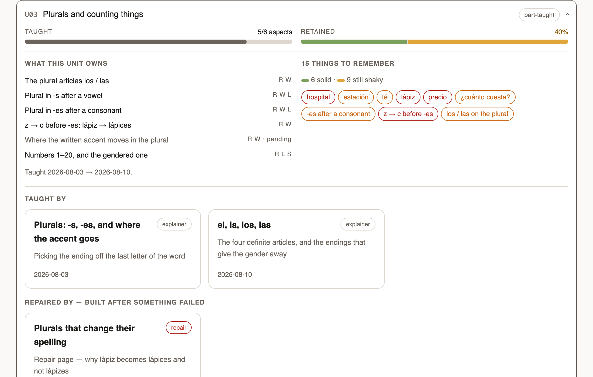

# mova

**A language-learning workspace run by your AI coding agent.** You pick the language and
the goal; the agent teaches, drills, tracks every word and every error, and keeps a
dashboard current — all in plain files you own, on your machine.

*mova* (мова) is Ukrainian for "language".

Every screenshot here comes from one workspace — an English speaker learning Spanish,
six weeks in, 63 days from a B1 exam. The pages are what the scripts in this repo actually
produce; the learner is invented.

## First five minutes

1. **Install an AI coding agent** — one of: [Claude Code](https://claude.com/claude-code),
   [opencode](https://opencode.ai), [Codex](https://openai.com/codex), or
   [Antigravity](https://antigravity.google). Never installed one, or would rather not pay
   for one? See [Starting from zero, without paying](docs/guide/free-setup.md).
2. **Take a copy of this repository** — the green **Use this template** button on GitHub,
   or download the zip and unpack it anywhere. Or simply give your agent the URL of this
   repo and ask it to make you a copy.
3. **Open that copy in your agent** — the folder you just unpacked or it just cloned — and
   say: **"set up my workspace"**.

The agent interviews you — four short topics, numbered so you can see the end from the
start: your languages, your goal, your time, and how wide you want this. Then it builds
everything on its own: your profile, your curriculum, your study plan. Expect a few minutes
of questions, then **5–15 minutes of building**. Spanish, French, German, Italian,
Portuguese, Greek and Romanian start straight away; any other language adds **around half
an hour** while your agent builds a grammar pack for it first. Your agent works out which one you are getting, tells you before
it starts, and reports each finished piece as it goes. It ends with a short tour of what it
made and how to use it, and one word to say when you're ready to begin.

> **Requirements**: Node.js ≥ 20 and git. Your agent checks for both during setup and
> installs what it can. They power the scheduling, the integrity checks, and the contract
> tests that keep your records honest.

## How you use it

**Chat is the only thing you operate.** You say a word; your agent runs the playbook behind
it and operates everything else — every script, every file, every check. The hub and the
deck are pages you read, never type into. Your job is to answer questions and study.

Three words carry an ordinary week:

| Say… | You get |
| --- | --- |
| **lesson** | The full session: everything due, then new material, a graded check, then practice aimed at exactly what the check missed |
| **drill** | Short practice: the due queue plus your top error patterns, sized to the time you have. Never new material |
| **review** | The weekly replan: pace, next week's drill targets, plan updates |

**How long a block takes is a budget you agree, not a promise this file can make.** You say what
you have; the set is sized to fit it, and cut before it is offered if it does not. For scale,
from the reference workspace this engine came out of: its drills ran 15, 36 and 55 minutes
depending on how much was due, and its one timed full lesson took about 70 — which did not have
to be a single sitting. Those are one person's numbers. Once you have a queue of your own, your
hub prices it from your own ledger.

Seven more cover writing practice, mock exams, capturing a word you met in the wild, tutor
sessions, improving the workspace itself, reporting a defect back to the template, and
pulling in template updates.

→ [Every command](docs/guide/commands.md) — all ten verbs, what you say to reach each
one, how long it takes and what it leaves behind.

### Your first session

The word setup hands you at the end of the tour is usually **lesson**. The first session
on it probes instead of teaching: a gentle placement across the early material, to find
what you already have. Everything after it is built on what it finds — where you start,
how fast you go, what gets drilled first. You can decline the probe and
begin learning straight away; the workspace then writes down that your starting level is a
guess, so no later session mistakes it for a measurement.

### Every session after that

1. **Open the hub and read *What to do next*.** Every session hands you the hub as a
   clickable `file://` link when it rebuilds the page — bookmark that link the first time
   and it stays your way in, loading from disk with no server and no internet. The block
   tells you how many items are due, what a `drill` costs you versus a `lesson` today,
   whether you are on your plan's pace, and the pointer the last session left for this one.
2. **Start a fresh chat with your agent and say the word.** One session, one conversation:
   every session opens by reading your files and closes by writing them, so nothing you
   need is carried in the chat.
3. **The session closes itself.** Ledgers updated, coverage flipped, the session logged,
   the hub and deck rebuilt, the tests run, the work committed — then a plain-language
   summary of what changed for you today, with no codes and no file paths.
4. **Between sessions, open the deck.** Every word and pattern you hold, filtered by unit,
   tier or part of speech, with either side hidden and revealed a row at a time. This is
   where you go over what *you* want to practice, rather than what the queue chose.
5. **Come back through the hub.** It lists every study page ever built for you, so any
   topic you have covered is one click away — the page it was taught from, with its audio.

That bookmark is the only one you need: **the deck** (`work/visuals/deck.html`) sits next
to the hub in your copy of the repo, and is one click from it. Both are regenerated from
the files that own each number, never hand-written. Study pages are self-contained HTML
with the audio embedded — they open from disk, work offline, and keep working forever.

A study page is built for one thing, then kept. The endings that change are marked so
the pattern is visible without reading; the `?` is the verification marker — that form is
the agent's word until a source or a tutor confirms it.

Setup proposes how wide this should be, from what your goal needs, and you can narrow it on
the spot. A narrow workspace — drills only, vocabulary only, writing only — answers to fewer
verbs and refuses the rest politely. Working with a tutor
adds **tutor-prep**: a pack to bring them, and a pass that ingests their corrections.

→ [How sessions run](docs/guide/how-sessions-run.md) — the five parts of a lesson, the
eight teaching beats, and where every file lands.

## What it tracks

- **A profile of you** — your languages ranked into a contrast ladder that decides which
  language an explanation is drawn from, your real time budget, your keyboard. It keeps
  what was *assumed* apart from what was *measured*.
- **Two ledgers** holding every word and grammar pattern, on a tier ladder that runs from
  same-day review out to 60 days. Due-ness is computed from the last date, never stored, so
  there is no schedule to corrupt. Each tier asks a harder question than the one below, and
  tier 3 is a gate: nothing counts as owned until you have produced it whole.
- **Coverage and retention, never blended.** What has been taught and what you actually
  hold are separate numbers, because the gap between them is the finding.

  
- **Your mistakes, coded and counted.** A taxonomy generated for your language pair, an
  append-only error log, and a tally that follows causes rather than symptoms and drops
  zones you have since re-tested clean. That tally is what the next drill aims at.
- **Honest measurement.** Every scored set is machine-checked for answers hidden in its own
  prompts; every set comes back as a full marked sheet; a repeat look at the same material
  the same day is labelled re-exposure and scores nothing; every language fact is verified,
  tutor-confirmed, or visibly marked unverified.
- **A goal contract** — an exam, a level, a list of scenarios in your own words, or a word
  count — whose spec sentence is the tie-breaker for every scope question.

→ [What it tracks](docs/guide/what-it-tracks.md) — the tier table, the tally semantics, the
measurement guards, and the four goal shapes.

## Adjusting it as you go

Most changes are one sentence in chat: shorter today, too easy, explain that through
Spanish, stop drilling this. Standing changes — pace, focus, deadline, the goal itself —
belong to the weekly `review`, which is also where the scheduler stops using its shipped
defaults and re-fits itself to your own recorded data. `retro` turns friction with the
workspace into a fix. `update` pulls template changes in as a conversation, never a merge —
ask **"anything new?"** for a read-only check that changes nothing, or let the weekly
`review` raise it for you.

Yours to steer directly: `materials/` for your own books and past papers, the link
registry, the theme, and your language pack — including the table that says which
characters your keyboard mangles, so they never count as mistakes.

→ [Adjusting it](docs/guide/adjusting-it.md) — every lever, plus the scripts the agent runs
on your behalf.

## Under the hood

Markdown and zero-dependency Node scripts in your own git repository. Nothing is in a
database, and nothing leaves your machine except dictionary lookups and text-to-speech.
[AGENTS.md](AGENTS.md) is the operational guide every agent reads; `docs/mechanics/` holds
the rules in force, each stating whether it is a guess, a response to something that
happened, or a measurement; `playbooks/` holds one flow per verb. `npm test` is the
contract suite, and it fails when the workspace's own records stop being trustworthy.
[CHANGELOG.md](CHANGELOG.md) records what changed and when.

## For maintainers

`upstream/map.md` is the porting contract from the workspace this engine was extracted
from, and `playbooks/sync-upstream.md` pulls its ongoing changes. See
[AGENTS.md](AGENTS.md) for the operational guide.
